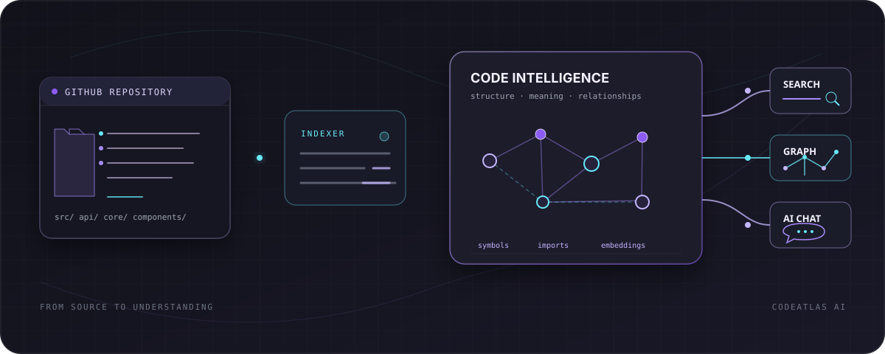
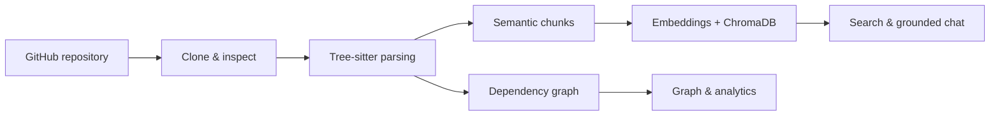
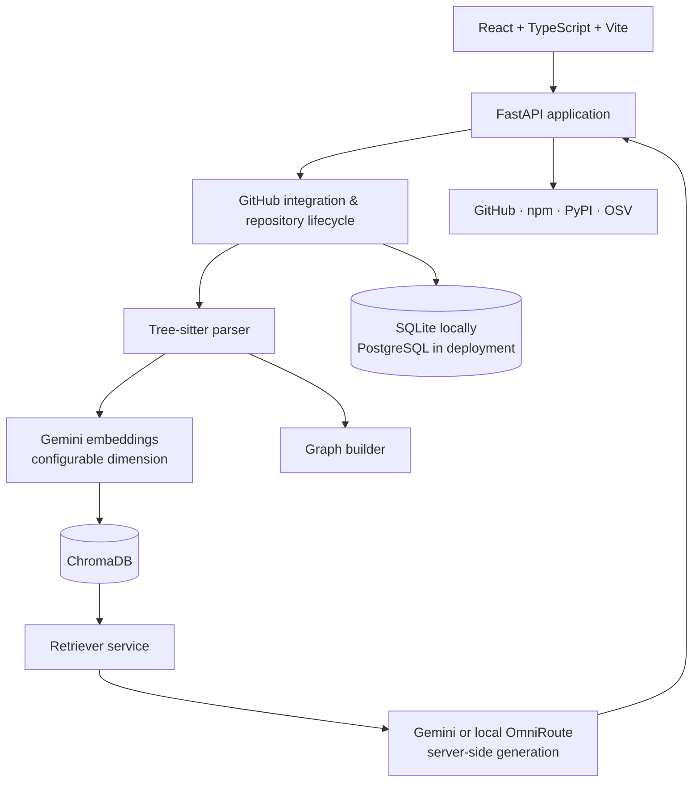

<div align="center">


# CodeAtlas AI

### Turn a GitHub repository into an explorable intelligence layer.

<p>Import a repository, let CodeAtlas map its structure, then search, inspect, visualize, and ask grounded questions about the code.</p>

<p><a href="https://github.com/anurag290805/codeatlas_ai">View on GitHub</a> · <a href="#quick-start">Quick start</a> · <a href="#architecture">Architecture</a> · <a href="#api-surface">API surface</a></p>

<p>
  
  
  
  
  
</p>

</div>

<div align="center">



`repository` → `index` → `understand` → `explore` → `ask`

</div>

## What is CodeAtlas AI?

CodeAtlas AI is a full-stack workspace for understanding public GitHub repositories. It clones and indexes source code, extracts meaningful symbols and relationships, stores repository-scoped embeddings, and turns the result into a set of focused tools: a code explorer, semantic search, grounded AI chat, dependency graph, analytics, and repository intelligence.



## See it in action

<table>
  <tr>
    <td width="20%"><strong>01 · IMPORT</strong><br />Add a public GitHub repository and choose its branch.</td>
    <td width="20%"><strong>02 · INDEX</strong><br />Clone, parse, graph, embed, and persist the repository asynchronously.</td>
    <td width="20%"><strong>03 · EXPLORE</strong><br />Browse folders and open source files in the repository workspace.</td>
    <td width="20%"><strong>04 · SEARCH</strong><br />Find semantically relevant code rather than matching filenames alone.</td>
    <td width="20%"><strong>05 · UNDERSTAND</strong><br />Ask questions and inspect answers with file-and-line citations.</td>
  </tr>
</table>

## Product surface

<table>
  <tr>
    <td width="50%"><strong>🗂 Repository explorer</strong><br />Expand the indexed file tree, open source files, and inspect syntax-highlighted code in a Monaco-powered viewer.</td>
    <td width="50%"><strong>⌕ Semantic search</strong><br />Search indexed code by intent using repository-scoped vector retrieval.</td>
  </tr>
  <tr>
    <td><strong>✦ Grounded AI chat</strong><br />Ask questions about an indexed repository and receive Markdown answers backed by retrieved source context and line-range citations.</td>
    <td><strong>⌁ Dependency graph</strong><br />Explore file, symbol, import, node, edge, neighbor, and path relationships in an interactive graph view.</td>
  </tr>
  <tr>
    <td><strong>◌ Repository analytics</strong><br />Inspect language distribution, files, folders, symbols, lines of code, chunks, embeddings, dependency nodes, storage, and commit activity.</td>
    <td><strong>🛡 Repository intelligence</strong><br />Read GitHub metadata, inspect npm/PyPI dependencies from supported manifests, and check pinned dependencies against OSV.</td>
  </tr>
  <tr>
    <td><strong>◈ Workspace isolation</strong><br />Repositories are associated with a signed, HttpOnly browser workspace cookie and vectors are namespaced per workspace and repository.</td>
    <td><strong>◐ Multiple themes</strong><br />System, Light, Dark, and branded Colorful themes persist through the frontend theme provider.</td>
  </tr>
</table>

## How CodeAtlas understands code

1. **Import** — validate a GitHub URL and register the repository in the current workspace.
2. **Clone** — keep a working copy for parsing, file previews, updates, and re-indexing.
3. **Parse** — use Tree-sitter to identify modules, classes, functions, methods, interfaces, enums, arrow functions, and imports in Python, JavaScript, and TypeScript.
4. **Chunk** — preserve symbol names, source text, language, checksums, and start/end lines as citation-ready units.
5. **Embed** — generate vectors through the configured Gemini embedding provider by default.
6. **Store** — persist repository-scoped vectors in ChromaDB and publish a staged index only after processing completes.
7. **Retrieve** — search, filter, deduplicate, rerank, and assemble relevant context for a query.
8. **Ground** — send that context to the configured server-side LLM provider and return the answer with source citations.

## AI chat, with source context

The chat surface is designed for questions such as:

> Where is authentication handled?

> What happens when a repository is imported?

> How is the dependency graph generated?

> Which files are involved in indexing?

Answers are produced only after retrieval from the selected repository. The response contract carries the cited file path, symbol when available, and start/end line range alongside the answer.

## Architecture



The backend is assembled from dedicated API routers, core services, database helpers, integrations, and agent modules. Indexing runs through an in-process background queue with recovery and staged publication so a failed run does not silently replace a healthy index.

## Technology

| Layer | Implementation |
| --- | --- |
| Frontend | React 19, TypeScript, Vite, React Router, TanStack Query |
| UI | Tailwind CSS, Base UI, Lucide, Framer Motion, next-themes |
| Code experience | Monaco Editor, syntax highlighter |
| Visualization | React Flow, Recharts |
| Backend | FastAPI, Pydantic, SQLAlchemy, Uvicorn |
| Parsing | Tree-sitter and bundled language grammars |
| Embeddings | Gemini Embedding API by default; Sentence Transformers provider is included in the backend |
| Generation | Gemini by default, or an OpenAI-compatible local OmniRoute gateway |
| Vector store | ChromaDB |
| Metadata | SQLite locally; PostgreSQL-compatible `DATABASE_URL` for hosted deployments |
| Integrations | GitPython, GitHub metadata, npm, PyPI, OSV |
| Delivery | Vercel frontend configuration, Render backend configuration, Docker Compose |

## Project structure

```text
codeatlas-ai/
├── backend/
│   ├── app/
│   │   ├── agents/          # Routed repository tasks and approval-gated patches
│   │   ├── api/             # FastAPI routers
│   │   ├── core/            # Parsing, embeddings, retrieval, graph, indexing
│   │   ├── db/              # SQLAlchemy database and CRUD helpers
│   │   ├── integrations/    # GitHub, npm, PyPI, OSV clients
│   │   └── models/          # Database and API schemas
│   ├── migrations/
│   ├── tests/
│   └── requirements.txt
├── frontend/
│   ├── src/
│   │   ├── components/      # Explorer, chat, graph, analytics, shared UI
│   │   ├── pages/           # Product routes
│   │   ├── api/             # Typed API clients
│   │   └── app/             # Router and providers
│   └── public/
├── docs/
├── scripts/
├── docker-compose.yml
├── render.yaml
└── vercel.json
```

## Quick start

### 1. Clone and configure

```bash
git clone https://github.com/anurag290805/codeatlas_ai.git
cd codeatlas_ai
cp backend/.env.example backend/.env
```

Set `GEMINI_API_KEY` and replace `WORKSPACE_SESSION_SECRET` with a random value of at least 32 characters in `backend/.env`.

### 2. Start the backend

```bash
cd backend
python3.11 -m venv .venv
source .venv/bin/activate
python -m pip install --upgrade pip
python -m pip install -r requirements.txt
python -m uvicorn app.main:app --reload --host 0.0.0.0 --port 8000
```

The API is available at `http://localhost:8000`. Interactive OpenAPI docs are at [`/docs`](http://localhost:8000/docs) and [`/redoc`](http://localhost:8000/redoc).

### 3. Start the frontend

In a second terminal:

```bash
cd frontend
npm install
cp .env.example .env
npm run dev
```

The Vite app uses `http://localhost:8000` and `/api` by default.

### Docker

From the repository root:

```bash
docker compose up --build
```

The Compose setup runs the backend and persists its local database, ChromaDB data, repositories, and logs through the configured volumes.

## Configuration

The checked-in examples are the source of truth. The most important variables are:

| Variable | Used by | Purpose |
| --- | --- | --- |
| `GEMINI_API_KEY` | Backend | Server-side Gemini generation and embeddings |
| `GEMINI_MODEL` | Backend | Gemini generation model |
| `GEMINI_TIMEOUT_SECONDS` | Backend | Generation timeout |
| `GEMINI_TEMPERATURE` | Backend | Generation temperature |
| `GEMINI_MAX_TOKENS` | Backend | Response token ceiling |
| `DATABASE_URL` | Backend | SQLite locally or PostgreSQL-compatible hosted database |
| `CHROMA_DB_PATH` | Backend | Local ChromaDB persistence directory |
| `REPOSITORIES_DIR` | Backend | Local repository working directory |
| `CORS_ALLOWED_ORIGINS` | Backend | Credentialed browser origins allowed to call the API |
| `WORKSPACE_SESSION_SECRET` | Backend | Signs the workspace cookie outside development |
| `VITE_API_BASE_URL` | Frontend | Backend origin, such as `http://localhost:8000` |
| `VITE_API_PREFIX` | Frontend | API prefix, `/api` by default |

Never put `GEMINI_API_KEY` or any other secret in a `VITE_` variable: Vite variables are shipped to the browser.

## Deployment

The repository includes configuration for the intended split deployment:

```text
Vercel frontend → Render FastAPI backend → Supabase/PostgreSQL
                                              ↘ ChromaDB + repository working cache
```

- `render.yaml` defines the backend service, its `backend` root, health check, and production secrets.
- `vercel.json` routes `/api/*` to the backend service and the remaining paths to the Vite frontend.
- Set `VITE_API_BASE_URL=https://codeatlas-ai-o8ot.onrender.com` on Vercel. On Render, set `CORS_ALLOWED_ORIGINS=https://codeatlas-dev.vercel.app` (or include it in the comma-separated list alongside any retained local or legacy origins).
- Hosted repository clones are a disposable working cache; database metadata and vector data are the durable parts of the deployment configuration.

## API surface

All feature routes are registered under `/api` by default.

| Capability | Representative routes |
| --- | --- |
| Repository lifecycle | `POST /repositories`, `GET /repositories`, `GET /repositories/{id}/files`, `POST /repositories/{id}/reindex`, `POST /repositories/{id}/update` |
| Retrieval and chat | `POST /query`, `POST /query/stream`, `POST /repositories/{id}/query` |
| Graph | `GET /repositories/{id}/graph`, `/statistics`, `/nodes`, `/edges`, `/neighbors/{node_id}`, `/path` |
| Analytics | `GET /analytics` and repository-scoped analytics data |
| Intelligence | `GET /repositories/{id}/github`, `/dependencies`, `/security` |
| Agent tasks | `POST /agent/tasks` and explicit approval at `POST /agent/tasks/approve` |
| System | `GET /health`, `GET /version`, `GET /docs` |

Modify-mode agent tasks are planned first and require a human approval token before a patch is applied.

## Quality checks

```bash
# Backend
cd backend
pytest -q

# Frontend
cd frontend
npm run lint
npm run build
```

The backend test suite covers parsing, retrieval, vector storage, API behavior, workspace isolation, indexing recovery, integrations, and approval flows.

## Contributing

Fork the repository, create a focused branch, make the change, run the backend and frontend checks above, then open a pull request with a concise description of the behavior changed.

## License

CodeAtlas AI is released under the [MIT License](LICENSE).

<div align="center">

**Understand the system behind the source.**

<a href="https://github.com/anurag290805/codeatlas_ai">Explore the repository →</a>

</div>
